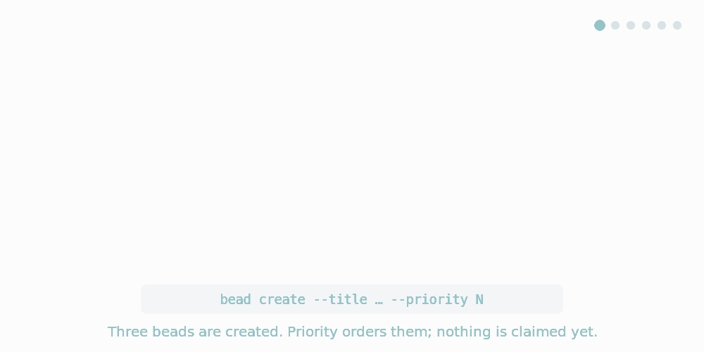
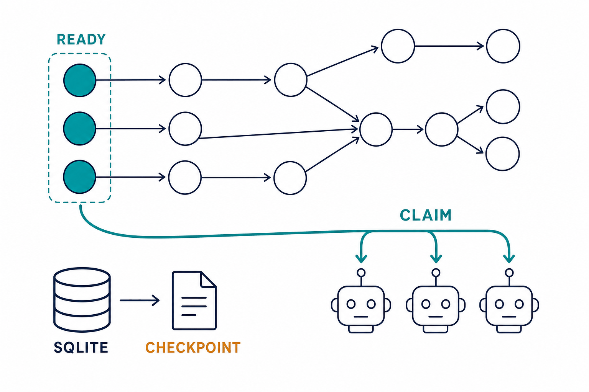

# bead-rs

`bead-rs` is a clean-room Rust task-coordination system for agent fleets. It
keeps a dependency graph of work items ("beads") in SQLite, hands out exactly
one unblocked bead per request through an atomic claim, and checkpoints the
whole workspace to deterministic JSONL that Git can track.

The installed binary is named `bead`.

<picture>
  <source media="(prefers-reduced-motion: reduce)" srcset="docs/img/bead-lifecycle-static.png">
  
</picture>

*The animation plays twice and stops. If your system asks for reduced motion
you get the [static storyboard](docs/img/bead-lifecycle-static.png) instead,
which shows the same six stages.*

Work items form a directed acyclic graph. The **ready frontier** is the set of
beads with nothing left blocking them — open, unassigned, not manually blocked,
and with every `blocks` edge already closed. Agents call `bead claim`, which
selects from that frontier and assigns the bead in a single transaction, so
concurrent claimants never receive the same bead. Closing a bead can expose its
dependents, which advances the frontier.

## Install

```bash
# One-line installer (recommended)
curl -fsSL https://github.com/jedarden/bead-rs/releases/latest/download/install.sh | bash
bead --version

# From GitHub (requires Rust 1.85+)
cargo install --git https://github.com/jedarden/bead-rs --bin bead

# From a local clone
cargo install --path .
```

SQLite is bundled; there is no system dependency and no network access at
runtime.

> **⚠️ Warning:** `cargo install bead` installs a different, unrelated crate
> (an OCI container runtime). Use `--bin bead` or the one-liner above.

## Building from source

### Environment requirements

- **Rust version:** 1.85 or newer (minimum MSRV: 1.85)
- **Tested with:** rustc 1.97.1 (8bab26f4f 2026-07-14)
- **Edition:** Rust 2024
- **Cargo:** 1.85 or newer

### Build commands

```bash
# Clone and build the current main tip
git clone https://github.com/jedarden/bead-rs.git
cd bead-rs

# Build the main binary
cargo build --release --bin bead

# (Optional) Build man page generator
cargo build --release --bin generate-man-pages

# (Optional) Build with attempt-resolution feature enabled
cargo build --release --bin bead --features attempt-resolution
```

### Building a pinned commit

Never `git checkout` an older commit in a shared checkout to build it — that
has destroyed another worker's uncommitted work here. Use the archive script,
which extracts the commit read-only and builds in a scratch directory:

```bash
scripts/build-from-archive.sh <commit-sha> --features attempt-resolution
```

See [BUILD_PROCEDURE.md](BUILD_PROCEDURE.md) ("Build Rule") and
[docs/build-attempt-resolution-binary.md](docs/build-attempt-resolution-binary.md).

### Note on byte-reproducibility

`build.rs` embeds a wall-clock build timestamp, so two builds of the same
source are not byte-identical by default and **no fresh build reproduces a
recorded pin's hash** — pinned binaries are verified by comparing their
sha256 against the `binary_sha256` in their `*.metadata.json`, never by
rebuilding. Setting `SOURCE_DATE_EPOCH` (embedded timestamp) and
`BEAD_COMMIT_SHA` (commit, for trees with no `.git`) makes two builds of the
same tree byte-identical. Details:
[docs/build-attempt-resolution-binary.md](docs/build-attempt-resolution-binary.md),
"What 'reproduce' means here".

### Build artifacts

After building, the binaries are located at:

- `bead` binary: `target/release/bead`
- Man page generator: `target/release/generate-man-pages`

### Feature flags

- **default** (empty): No features enabled by default
- **attempt-resolution**: marker feature for the attempt-resolution contract; it currently gates no code — the functionality is always compiled in (see [docs/build-attempt-resolution-binary.md](docs/build-attempt-resolution-binary.md), "Distinctness")

### Current version information

- **Version:** 0.2.6
- **Feature-enabled build SHA (declared rebuild target):** `861cdcbfebeb70a9ebc6a2e33ee98cef97274fec`
- **Pinned binaries of record:** [`pinned-binaries/`](pinned-binaries/) — see [pinned-binaries/COMMITS.md](pinned-binaries/COMMITS.md) for the SHA lineage and each pin's built-from provenance
- **Git repository:** https://github.com/jedarden/bead-rs

### Verifying the build

After building, verify the installation:

```bash
./target/release/bead --version
./target/release/bead capabilities
```

The `--version` output should show version 0.2.6, and `capabilities` should emit a machine-readable feature contract document.

### Comprehensive build documentation

For detailed build procedures, metadata capture, and binary uniqueness verification, see:

- **[docs/attempts-binary-build.md](docs/attempts-binary-build.md)** - Complete attempts binary build process and verification guide
- **[docs/build-attempt-resolution-binary.md](docs/build-attempt-resolution-binary.md)** - Attempt-resolution build process and binary distinctness
- **[pinned-binaries/README.md](pinned-binaries/README.md)** - Pinned binary documentation and hash comparisons
- **[BUILD_PROCEDURE.md](BUILD_PROCEDURE.md)** - Step-by-step build instructions

### Pinned feature-enabled build (attempt-resolution)

The feature-enabled pins of record live in [`pinned-binaries/`](pinned-binaries/),
built with `cargo build --release --locked --features attempt-resolution` via
`scripts/build-from-archive.sh`:

| Pin | sha256 | Built from (provenance) | Rebuild target |
|---|---|---|---|
| `pinned-binaries/bead-attempt-resolution-f25ab5c` | `9a8455f25bacf5bc961bd740442fdc1b30a67fb6e38d304c23c97a57cf57b04e` | `f25ab5c91c09…` (lost lineage) | `b0d7840f6c96cd45e16ea05b7babdb42ef0d2654` |
| `pinned-binaries/bead-attempt-resolution-e115609` | `68fe8d534721be4ba4147312364d8f0b216b62f3093e85e7c91f0a0db695a645` | `e1156098b01…` (lost lineage) | `861cdcbfebeb70a9ebc6a2e33ee98cef97274fec` |

`~/.local/bin/bead-77db95e` (sha256
`e9d44131f7cfab3bf43d6a9dc0040e7759ed64f278808a354576f418429150b4`) is an
older install-copy of a build whose commit the 2026-09-02 force-push removed;
the hash is true of that file, but its commit no longer resolves and
`~/.local/bin` is not the pin location of record.

To verify a pin — by hash comparison, never by rebuilding (see "Note on
byte-reproducibility"):

```bash
sha256sum pinned-binaries/bead-attempt-resolution-f25ab5c
# Compare against binary_sha256 in pinned-binaries/bead-attempt-resolution-f25ab5c.metadata.json

./pinned-binaries/bead-attempt-resolution-f25ab5c --version
# bead 0.2.6 (f25ab5c-dirty 2026-09-02T10:52:25Z)

./pinned-binaries/bead-attempt-resolution-f25ab5c capabilities | jq '.attempt_outcome.supported'
# true
```

To build a fresh feature-enabled binary, see "Building a pinned commit" above.

### Development build

For faster iteration during development:

```bash
# Build without optimizations (faster compilation)
cargo build --bin bead

# Run tests
cargo test

# Check code formatting and linting
cargo fmt --check
cargo clippy -- -D warnings
```

### Installing locally

To install the built binary to your local cargo bin directory:

```bash
cargo install --path .
```

This installs `bead` to `~/.cargo/bin/bead` (or your configured CARGO_HOME).

## Quick start

```bash
bead init --prefix demo

design=$(bead create --title "Design schema" --priority 1)
store=$(bead create --title "Implement store" --priority 2)
bead create --title "Write docs" --priority 3

# `store` cannot start until `design` is closed.
bead dep add "$store" "$design"

bead list --ready                       # design + docs; store is blocked
bead claim --assignee worker-1          # atomically takes the highest-priority ready bead
bead close "$design" --reason "Schema agreed"
bead list --ready                       # store has now joined the frontier

bead sync flush-only                    # idempotent check; publishes nothing new
```


That recording is the sequence above, run against the real binary — note that
`store` is absent from the first `list --ready` because it is blocked, and
present in the second because closing `design` satisfied its only edge.

`bead why --id <ID>` explains any bead's state: whether it is ready, what is
blocking it, how it ranks for claiming, and which operations are currently
legal.

## State model

Two artifacts, with different jobs:

| Path | Role | Committed |
| --- | --- | --- |
| `.beads/beads.db` | SQLite, authoritative live state | No |
| `.beads/checkpoint/` | Deterministic JSONL checkpoint | Yes |

The checkpoint carries issues, the event history, provenance receipts, and the
dependency and label graph. **Every successful mutation publishes it
automatically** after its transaction commits, so it is never silently behind
the database and a clone of the repository reproduces the current state.
`bead sync flush-only` remains an explicit idempotent check — against a
current checkpoint it publishes nothing and exits 0 — and `--no-auto-flush` or
`checkpoint.auto_flush: false` in `.beads/config.json` suppresses automatic
publication, leaving the checkpoint to be advanced by that explicit command.

Recovering a fresh clone, which arrives with a checkpoint but no database:

```bash
generation=$(jq -r .generation_id .beads/checkpoint/current.json)
bead restore --source .beads/checkpoint --generation "$generation" --actor "$USER"
bead doctor
```

`bead restore` verifies the named pointer, content-addressed root, sharded
closure (when present), counts, event continuity, and graph before initializing
or changing the target. It refuses a non-empty target unless
`--allow-non-empty` is explicit, writes an actor-attributed provenance receipt,
and reports the exact generation and record counts restored. Bare
`forensic.jsonl` and checkpoint-archaeology views are not recovery sources.
`sync import-only` remains the lower-level interchange/merge primitive, not the
doctor-recommended disaster-recovery path.

Taking another machine's advancement, after `git pull` delivers a newer
checkpoint over your live database:

```bash
bead sync status        # Relationship: remote-advanced
bead sync reconcile --actor "$USER"
bead sync status        # Relationship: aligned, ready to commit
```

`remote-advanced` is a store relationship, observed from the workspace
artifacts alone: the pulled pointer verifies, stages, and carries this
workspace's UUID, every live event appears in it with identical content, and
the recorded state claims no more history than the database holds.
`bead sync reconcile` merges that checkpoint through the same machinery as
`sync import-only --merge` — one transaction, conflict detection, an
actor-attributed merge receipt — and, under the automatic publication default,
the post-commit chokepoint publishes the generation covering the merge. Nothing
is reconciled blind: `sync flush-only` refuses to publish over a
remote-advanced checkpoint (exit 4, naming reconcile) so the pulled advancement
cannot be discarded, `--dry-run` previews the merge without mutating anything,
and `bead doctor` reports the state with its remedy rather than as a failure.
Every other checkpoint-ahead-of-live shape — a tampered root, a foreign store
UUID, a live event the pulled checkpoint lacks or contradicts — stays a
fail-closed `covered-ahead-integrity-failure` (exit 5) that names the failed
qualifier; mutate only after reconciling, because a local change made while
remote-advanced leaves exactly that divergence. The workflow is pull,
reconcile, then work.

For read-only historical inspection, use checkpoint archaeology rather than
importing a generation:

```bash
bead query --checkpoint .beads/checkpoint/previous.json --file open-work.json
bead sync diff .beads/checkpoint/previous.json .beads/checkpoint/current.json
bead sync bisect --checkpoint old/current.json --checkpoint new/current.json --file query.json
```

Each command verifies the retained pointer and its complete object closure
before serving an ephemeral view. A manifest or monolithic root is accepted
only when `current.json` or `previous.json` selects it. Archaeology JSON is
explicitly non-importable; it is useful evidence, never a recovery source.

`bead doctor` runs read-only integrity checks across store, backup, schema,
dependencies, and comments; `--repair` performs only safe, non-speculative
repairs, and `--rehearse` proves the recovery path by restoring into a throwaway
workspace and comparing the result for semantic equivalence.

## Output contracts

- `--json` on `list`, `changes`, and `query --output-json` emits **NDJSON** —
  one compact object per line, not a JSON array.
- `bead show --json` emits a **one-element array**, which is what NEEDLE's
  subprocess contract expects.
- `bead create` prints only the new bead ID and a newline, so it can be captured
  directly into a shell variable.
- `bead claim` on an empty frontier is success, not failure: exit 0 with `{}`.
- `bead capabilities` emits a machine-readable contract document for feature
  negotiation.

Exit codes are stable across every command:

| Code | Meaning |
| --- | --- |
| 0 | Success |
| 1 | Internal failure |
| 2 | CLI usage or validation error |
| 3 | Workspace, issue, or file not found |
| 4 | Conflict — invalid transition, revision guard, dependency cycle, single-claim refusal |
| 5 | Malformed input or integrity failure |

## Coordinating a fleet



- **Atomic claim.** Selection and assignment share one transaction under the
  `fifo-v1` policy (priority ASC, created_at ASC, id ASC). `aging-v1`,
  `impact-v1`, `rotation-v1`, and `balanced-v1` are also available via
  `--policy`.
- **Leases.** `bead claim --lease-ttl SECONDS` issues a lease with a
  monotonically increasing fencing token, so a crashed or partitioned worker
  cannot mutate work that has since been reassigned. Lease rows are retained
  per claim epoch; release and close leave the audit history intact, and a
  later leased claim appends a new row. The highest token is the latest epoch.
- **Single-claim guard.** `bead claim --single-claim` refuses the claim when
  the assignee already holds an `in_progress` issue in the workspace, failing
  with exit 4 and reason code `assignee_has_active_claim` naming the blocking
  issue. Opt-in per call, like `--lease-ttl`; it bounds claim accumulation but
  does not detect stale claims — combine it with a lease TTL to bound how long
  an abandoned claim can persist.
- **Workspace-local resource locks.** Declare keys with `bead create
  --resource-key KEY` or `bead resource add ID --key KEY`. A claim acquires all
  declared keys atomically; `release`, `close`, and lease expiry return them,
  and `bead why --json` reports `resource_conflict` when another issue holds a
  needed key. These are scheduling exclusions in one native workspace, never
  distributed locks or coordination between separate stores.
- **Revision guards.** `--if-revision N` on `update`, `release`, `close`, and
  `reopen` gives optimistic concurrency control; a stale revision fails with
  exit 4 rather than silently losing an update.
- **Inspect without reserving.** `bead list --ready` uses the same ordering as
  `claim` but takes nothing off the frontier.
- **Change feed.** `bead changes --since <CURSOR>` lets a consumer catch up
  incrementally instead of rescanning.

## Interoperability

bead-rs keeps a private native schema. Per [ADR-002](docs/adr/002-agent-guided-rehydration-over-cross-tool-migration.md)
it does not parse or transform another tool's checkpoint format:

- `native-v1` — full fidelity, the default; the only supported recovery format
- `needle-v1` — NEEDLE subprocess compatibility

`bead compare --id <ID> --source <P> --target <P>` reports which fields a
given profile pair preserves, transforms, omits, or cannot represent, scoped
to these two profiles. Moving existing work from another tracker is
**agent-guided rehydration**, not import: an agent reads the source
repository read-only and recreates work through public `bead` commands,
producing a reconciliation report rather than a synthesized checkpoint. See
[interoperability notes](docs/notes/interoperability-architecture.md) and
[NEEDLE compatibility](docs/notes/needle-compatibility.md).

## CLI conventions worth knowing

bead-rs is an independent implementation, not a drop-in replacement for any
other task tracker. These conventions catch people out:

| | |
| --- | --- |
| The binary is `bead` | not the crate name `bead-rs` |
| `create` takes a flag | `bead create --title "Title"`, not a positional title |
| Ready work is a filter | `bead list --ready`, not a `ready` command |
| `flush-only` is a subcommand | `bead sync flush-only`, not `bead sync --flush-only` |
| `--json` emits NDJSON | one object per line, not an array (except `show`, which emits a one-element array) |
| Manual blocking | `bead list --blocked` shows manually blocked open issues; `--status blocked` is an alias |
| Effective status | JSON output includes `manual_blocked` (bool) and `effective_status` (shows "blocked" when manually blocked) |

## Documentation

- `bead --help` for the command inventory; `bead <COMMAND> --help` for the full
  description, examples, and semantics of any command.
- Man pages covering the whole command tree (45 pages, named `bead.1`,
  `bead-create.1`, `bead-sync-flush-only.1`, …) are generated with
  `cargo run --bin generate-man-pages`. See [MAN_PAGES.md](MAN_PAGES.md).
- The [0.1 implementation plan](docs/plan/plan.md) defines the native schema,
  lifecycle, dependency, checkpoint, CLI, and verification design.
- Post-0.1 candidates and rejected alternatives live in the
  [ideas ledger](docs/notes/ideas-ledger.md).

Both animations are generated from committed sources, so they can be refreshed
rather than redrawn:

```bash
# lifecycle animation (needs cairosvg + Pillow)
python3 docs/img/generate-lifecycle-animation.py

# terminal screencast (needs vhs, which needs ttyd + ffmpeg)
cargo install --path . && vhs docs/img/bead-workflow.tape
```

The screencast drives the real binary, so it cannot quietly disagree with the
CLI: if behaviour changes, re-running the tape either shows the change or
visibly fails.

The lifecycle animation is timed against the classical animation principles,
used to carry meaning rather than decoration — the claim fires in 0.2s against
0.4–0.6s elsewhere because atomicity is the point, and closing `design` sends a
ripple along the edge so that `store` turning ready reads as a consequence
rather than a coincidence.

It also targets WCAG 2.1 AA. Every colour holding text clears 4.5:1 and every
meaningful graphic clears 3:1, asserted at generation time so the palette
cannot regress; state is never colour-only, since each bead carries a text tag;
the animation plays a fixed number of times rather than looping forever; and a
`prefers-reduced-motion` source serves the static storyboard instead. Emphasis
is carried by scale and stroke weight rather than by dimming, because a dim
deep enough to read as staging takes text below the contrast floor. The
generator documents both mappings in full.

Every `bead ...` example printed in the help text is parsed by the real CLI in
the test suite, so a documented invocation cannot drift from the interface it
documents.

## Project status

The core CLI is implemented and in use: workspace lifecycle, issue CRUD,
labels, the dependency graph, atomic and leased claims, checkpoint flush and
restore, diagnostics, the query language, the change feed, profiles, and
migration. It has been exercised end to end by building a real multi-bead
project through it.

Treat it as young software rather than settled: it is a 0.1, its history
includes bugs that a green test suite did not catch, and it is worth running
`bead doctor` and a hands-on smoke test of the path you care about before
depending on it for anything critical.

## Independence

`bead-rs` has an independent Git history and is implemented from the
specifications committed to this repository. Clean-room contributors must
follow [AGENTS.md](AGENTS.md) and [PROVENANCE.md](PROVENANCE.md).

`bead-rs` is not affiliated with or endorsed by any other bead implementation.

## License

Apache License 2.0. See [LICENSE](LICENSE) and [NOTICE](NOTICE).

---

Part of [jedarden.com](https://jedarden.com) · Read the write-up: [jedarden.com/guides/workflow/#s07-atomic-claims](https://jedarden.com/guides/workflow/#s07-atomic-claims)

*This GitHub repo is a read-only mirror of git.ardenone.com/jedarden/bead-rs — issues and PRs are welcome here either way.*
